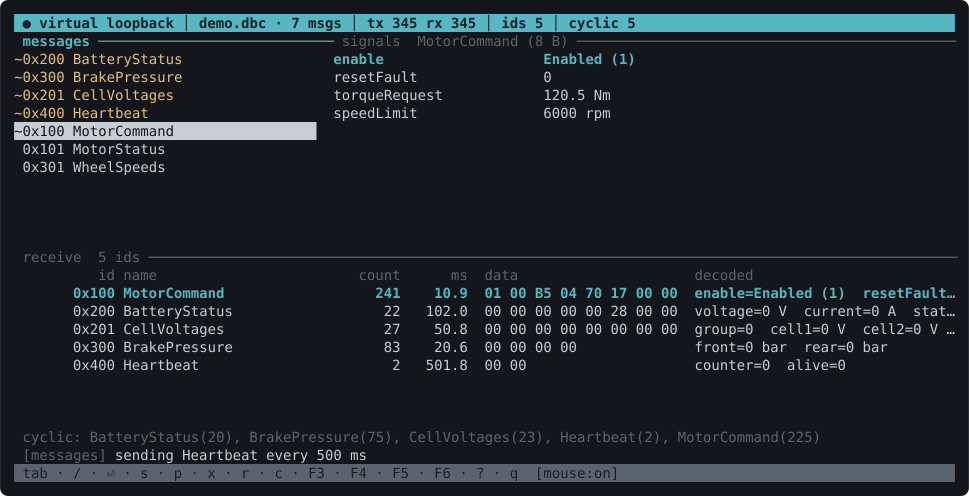
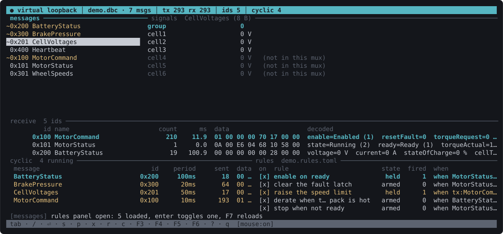

<p align="center">
  
</p>
<h1 align="center">tuican</h1>
<p align="center">A terminal CAN bench: pick an adapter, load a DBC, send and watch traffic.</p>



## Install

```
cargo install tuican
```

Or from a clone:

```
git clone https://github.com/Bridiro/tuican
cd tuican
cargo install --path .
```

Building needs a C compiler, because libusb is compiled from source by default.
On Linux it also needs `libudev` headers (`libudev-dev` on Debian and Ubuntu,
`systemd-devel` on Fedora). If you already have libusb-1.0 installed, or you do
not need serial adapters, you can skip either:

```
cargo install tuican --no-default-features --features udev             # system libusb
cargo install tuican --no-default-features --features vendored-libusb  # no libudev
```

## Try it without hardware

The repository ships a small demo database and a set of rules:

```
tuican --dbc examples/demo.dbc --rules examples/demo.rules.toml --interface virtual
```

The virtual interface is a loopback, so anything you send comes back as receive
traffic. Select `MotorStatus`, set `ready` to 1, press `s`, and watch
`MotorCommand` start going out on its own because a rule fired.

## Running

```
tuican
```

No arguments needed. tuican finds the DBC files below the working directory and
the adapters plugged in, and asks which you want. The next launch remembers
both, and `tuican --last` skips straight past the pickers.

The screen is a message list and a signal editor on top, a live receive table
below, and two optional panels for periodic sends and rules. Everything adapts
to the terminal size, including stacking the panes when the window is narrow.

## Keys

| | |
|---|---|
| `tab` / `shift-tab`, `h` `l` | move between panes |
| `j` `k`, `↑ ↓` | move within a pane |
| `5j`, `12k` | repeat a motion |
| `gg` / `G` / `42G` | top, bottom, that row |
| `ctrl-d` / `ctrl-u` | half page down / up |
| `ctrl-f` / `ctrl-b` | page down / up |
| `H` / `M` / `L` | top, middle, bottom of the screen |
| `/` | filter messages by name or hex id |
| `enter` | edit the selected signal, or act on the panel row |
| `s` | send the selected message once |
| `p` | start or stop sending it periodically |
| `d` | stop the periodic send under the cursor |
| `x` | stop every periodic send |
| `r` | raw send, for example `4E5 11 22 33` |
| `c` | clear the receive table |
| `F2` | mouse capture on/off (off restores terminal text selection) |
| `F3` | load a different DBC, without dropping the link |
| `F4` | connect to a different interface |
| `F5` | cyclic panel: everything going out, with periods and counts |
| `F6` | rules panel |
| `F7` | reload the rules file |
| `?` | key help |
| `q` | quit |

`/` starts from an empty filter each time, so re-filtering is typing a new
search rather than cancelling and retyping. `esc` puts the old one back.

The mouse is optional and additive. Click selects, the wheel scrolls the pane
under the pointer without moving keyboard focus. Nothing is mouse-only, and no
click ever sends a frame.

## Rules

A rule watches signals and, when its condition becomes true, changes what you
are sending. It exists so that simulating a board is not a sequence of manual
keystrokes.

```toml
[[rule]]
name = "enable on ready"
all = [
  { message = "MotorStatus", signal = "ready", op = "eq", value = 1 },
]
then = [
  { action = "set", message = "MotorCommand", signal = "enable", value = 1 },
  { action = "cyclic", message = "MotorCommand", period_ms = 10 },
]
```



Rules fire on the rising edge, so that one fires once when the motor reports
ready, not on every frame while it stays ready.

Rules are independent, so any number of them can react to the same frame. A rule
can also watch a signal you are sending (`source = "tx"`), letting one rule's
action satisfy another rule's condition within the same tick. Together those
give a graph of reactions rather than a chain, and a cycle in that graph is
detected and reported instead of spinning.

Operators are `eq`, `ne`, `lt`, `le`, `gt`, `ge` and `changed`. Actions are
`set`, `send`, `cyclic` and `stop`. Every message and signal name is checked
against the loaded DBC when the file loads, and anything the DBC does not define
is flagged in the rules panel rather than silently never matching.

Put the file next to your DBC as `tuican.rules.toml` and tuican finds it, or
pass `--rules FILE`. `F6` shows the panel, `enter` toggles a rule, `F7` reloads
the file without restarting. A commented template is in
[examples/demo.rules.toml](examples/demo.rules.toml).

## Adapters

One is live at a time, and `F4` switches without restarting.

| | |
|---|---|
| **gs_usb / candleLight** | Over libusb, so it works on macOS where there is no kernel driver. Pick a bitrate in the picker and tuican asks the device for its clock and solves the bit timing. |
| **SocketCAN** | Linux only. Bring the link up first: `sudo ip link set can0 up type can bitrate 500000`. |
| **slcan** | Lawicel ASCII adapters over a serial port. |
| **virtual** | Loopback. Always offered, so the tool is usable with nothing plugged in. |

On Linux, `tuican --print-udev-rule` prints the rule that fixes the usual
permission error on USB adapters.

If the board is reset while connected, the link drops. tuican notices, reopens
it, and puts the periodic sends back, so a reset costs you nothing. The header
shows `link lost, reconnecting` while it retries. A gs_usb adapter that comes
back at a different USB address is found again by its vendor and product ids.

## Flags

Every one is optional and has a discovery fallback.

```
tuican --dbc board.dbc
tuican --dbc board.dbc --rules car.rules.toml
tuican --dbc board.dbc --interface socketcan --channel can0
tuican --interface gs_usb --bitrate 1000000
tuican --last                    # reconnect to the previous session, no pickers
```

## Notes

- Logs go to a file, never the screen. Run `RUST_LOG=debug tuican`, then read
  `tuican.log` under your platform's state directory.
- Config (last interface, bitrate, DBC, rules file, mouse setting) lives in
  `tuican/config.toml` under your platform's config directory.
- Classic CAN only for now. The payload type and the codec are already 64-byte
  clean, so CAN FD is a transport-level change.

## Status

The gs_usb path is what I use daily, on macOS with a candleLight adapter.
SocketCAN and slcan are written to their specifications and compile, but I have
not yet exercised them against hardware. Reports welcome.

## AI assistance

During development, I made use of AI tools significantly on the interface and rules feature,
with help on the rest of the codebase as well. I state this here for transparency.

## License

Apache-2.0. See [LICENSE](LICENSE).
